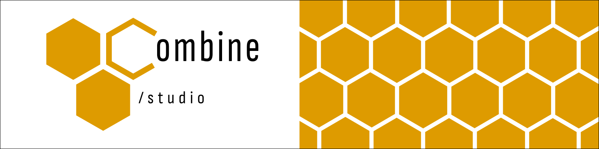

 

Hi, I'm <strong>@life-is-string</strong>!

<ul>
<li>📘 Undergraduate IT technician at CEFET-MG</li>
<li>📚 Ongoing bachelor's degree in Computer Science at UFMG</li>
<li>🚀 Aspiring software developer and ML engineer</li>
</ul>
<h3>💻 WIPs:</h3>
<ul>
  <li>📦 POC Online Order and Cart API Fullstack System with React and Node.js</li>
</ul>
<h3>⭐ Checkout my starred repos:</h3>
<ul>
  <li><a href = "https://github.com/life-is-string/Excel-sheet-data-mining-with-Python">⛏ Excel sheet data mining with Python</a></li>
  <li><a href = "https://github.com/LoiraDoTchan/TCC--Tecnologia-assistiva-para-cegos" >👓 Object detection technology with ESP32-CAM + Android + Clarifai + Ultrassonic Sensor</a></li>
</ul>

 

    
  
<em>In memoriam of <strong>Jessie</strong> Wherever you are, I hope you are proud of me...</em>

  
  <picture>
    <source width = "700em" media="(prefers-color-scheme: dark)" srcset="https://raw.githubusercontent.com/life-is-string/life-is-string/output/github-contribution-grid-snake-dark.svg">
    
  </picture>

<h2 align=center>Languages and Frameworks</h2>

  
  
  
  
  
  
  
  
  
  

<h2 align=center>My environments</h2>

